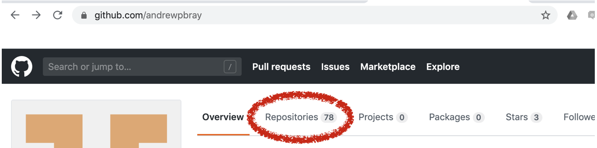
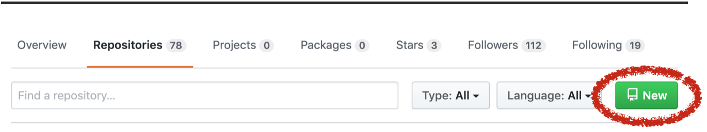
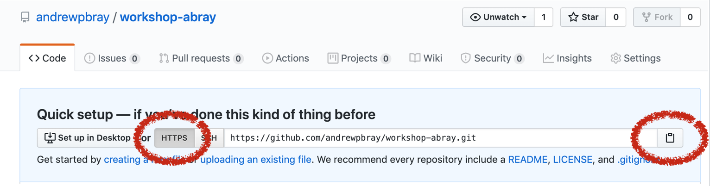

# Part I: Working Solo

Once you are in your breakout rooms introduce yourself to your groupmates and exchange GitHub usernames (go ahead and write these down somewhere). Then, working independently, each person will:

1. Go to your personal github page (for example, mine is www.github.com/andrewpbray).

2. Click the Repository tab along the top menu.

{width=70%}

3. Click the green New Repository button along the right side.

{width=70%}

4. Fill in the name of your repository using `github-workshop-abray` (but with your own name), leave the other fields blank, then click the green Create Respository button.

5. Be sure the grey HTTP button is selected, then click the clipboard at the right to copy this URL to your clipboard.

{width=65%}

6. Click over to [rstudio.reed.edu](rstudio.reed.edu) and login.

7. At the upper-right corner, click the Project tab and select New Project.

{width=70%}

