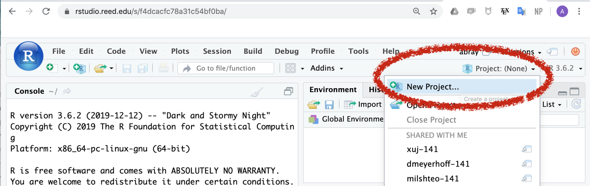

# Part I: Working Solo

Once you are in your breakout rooms introduce yourself to your
groupmates and exchange GitHub usernames (go ahead and write these down
somewhere). Then, working independently, each person will:

1.  Go to your personal github page (for example, mine is
    www.github.com/andrewpbray).

2.  Click the Repository tab along the top menu.


3.  Click the green New Repository button along the right side.


4.  Fill in the name of your repository using `github-workshop-abray`
    (but with your own name), leave the other fields blank, then click
    the green Create Repository button.

5.  Be sure the grey HTTP button is selected, then click the clipboard
    at the right to copy this URL to your clipboard.


6.  Click over to [rstudio.reed.edu](rstudio.reed.edu) and login.

7.  At the upper-right corner, click the Project tab and select New
    Project.



8.  Click Version Control \> Git \> then paste your repository URL into
    the first field and click Create Project.

9.  In the far upper right corner, click File \> New File and
    immediately click the Save icon at the top of the file and name it
    `README.md`.

10. Click over to the Git tab in the upper-right quadrant of the screen
    and check that your new file appears there.


11. Click the check box next to `README.md` and click the Commit button.
    On the next screen, enter `initial commit` into the text field,
    click Commit, then click the Push button. When prompted, provide
    your username and password for your GitHub account (not your Reed
    account).

12. In your browser, click over to your GitHub repo and check that it
    now contains your blank `README.md`.

13. Back in RStudio, add the following lines to the top of your
    `README.md` (except plug in your name) and click the Save button.

<!-- end list -->

``` r
# Welcome to my repository

Authors: Andrew Bray
```

14. Over in the git pane, click the check box next to `README.md` and
    click the commit button. On the next screen, enter `added title and
    name` into the text field, click Commit, then click the Push button.
    When prompted, provide your username and password for your GitHub
    account.
